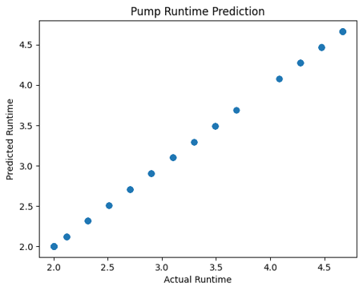
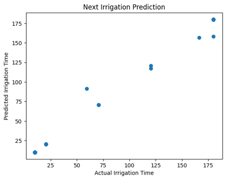
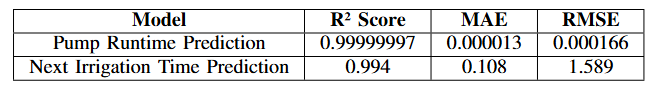

# 💧 fyp-irrigation_model_training

A machine learning-based irrigation control system that uses a Random Forest model trained on real-time environmental data collected from IoT sensors. The system predicts optimal irrigation actions to automate greenhouse operations efficiently.

---

##  Project Description

This project focuses on intelligent irrigation management using machine learning. Environmental data collected from sensors is used to train a Random Forest model, which predicts when to activate irrigation systems such as water pumps and ventilation fans. The goal is to optimize water usage, maintain ideal plant conditions, and enable data-driven greenhouse automation.

---

## ⚙️ Hardware Setup

The data used for training was collected using:

-  **Raspberry Pi**
-  Temperature & Humidity Sensor
-  Water Pump
-  Ventilation Fan

These components work together to monitor environmental conditions and control irrigation in real time.

---

## 📊 Dataset

- Data was **manually collected** from real-time greenhouse conditions  
- Includes environmental and actuator-related features  
- Used for supervised learning  

---

## 🧠 Model

- Algorithm: **Random Forest Regressor / Classifier**
- Purpose: Predict irrigation requirements and actuator control  
- Framework: **Scikit-learn**

---

##  Features Used

The model is trained on environmental and system features such as:

- Temperature  
- Humidity  
- Soil Moisture  
- Time-based features (moisture dry rate)  
- Actuator states (pump/fan status)

---

##  Workflow

1. Collect real-time sensor data using Raspberry Pi  
2. Preprocess and clean the dataset  
3. Perform feature engineering  
4. Train Random Forest model  
5. Evaluate model performance  
6. Use model predictions to control:
   - Water pump  
   - Ventilation fan  

---

## Results

## Predicted vs Actual Pump Runtime
<p align="center">
  
</p>

## Predicted vs Actual Next Irrigation Time
<p align="center">
  
</p>

## Performance Metrices
<p align="center">
  
</p>


## 📦 requirements.txt

```txt
numpy
pandas
scikit-learn
matplotlib
seaborn
joblib
